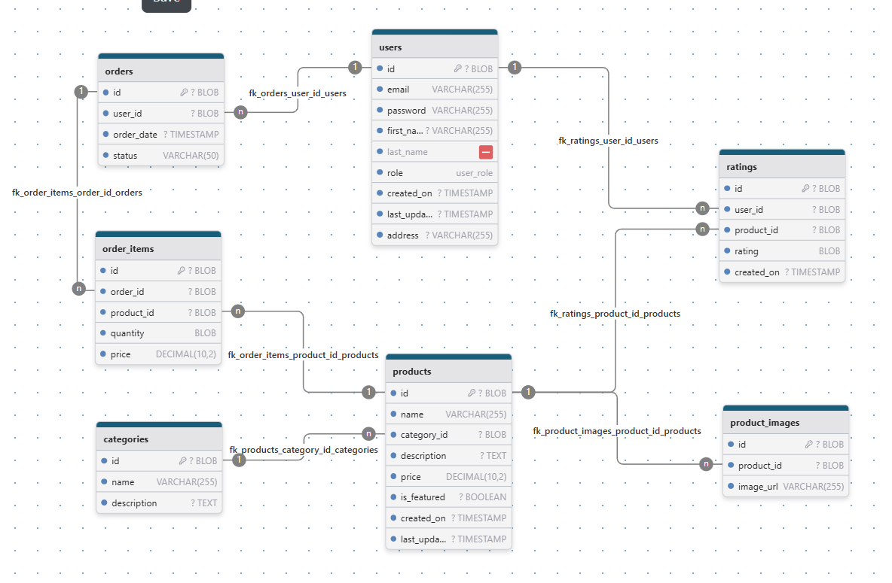

# ecom

## Installation

1. Build the Docker image:

```bash
docker build -t my-java-app .
```

2. Run the Docker container:

```bash
docker run -p 8080:8080 my-java-app
```

3. Access the application:

```bash
http://localhost:8080
```

## Schema


