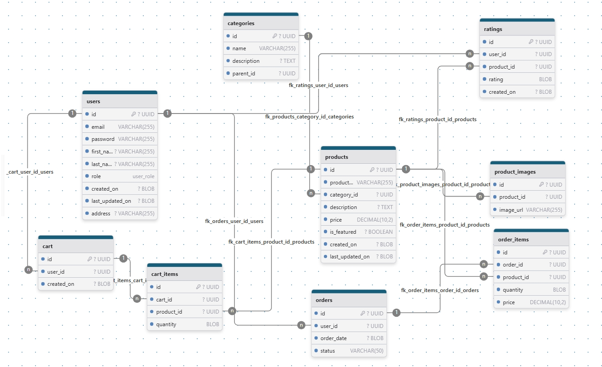

# ecom

## Installation

1. Build the Docker image:

```bash
docker build -t my-java-app .
```

2. Run the Docker container:

```bash
docker run -p 8080:8080 my-java-app
```

3. Access the application:

```bash
http://localhost:8080
```

## Schema



## Roles

- CUSTOMER
- ADMIN

```bash
/home/khoi/code/nashtech/ecommerce/
├── src/main/java/com/example/ecommerce/
│ ├── config/
│ │ ├── JwtProperties.java
│ │ ├── SecurityConfig.java (replaces security config in SwaggerConfig)
│ │ └── DataInitializer.java
│ │
│ ├── controller/
│ │ ├── AuthController.java
│ │ └── AdminController.java (optional for testing role-based access)
│ │
│ ├── dto/
│ │ ├── AuthRequest.java
│ │ ├── AuthResponse.java
│ │ └── RegisterRequest.java
│ │
│ ├── repository/
│ │ └── RoleRepository.java
│ │
│ ├── security/ (new directory)
│ │ ├── JwtUtils.java
│ │ ├── JwtAuthenticationFilter.java
│ │ ├── AuthEntryPointJwt.java
│ │ ├── UserDetailsImpl.java
│ │ └── UserDetailsServiceImpl.java
│ │
│ └── exception/
│ └── ResourceNotFoundException.java (you already have this)
│
└── src/main/resources/
└── application.properties (add JWT properties)
```
